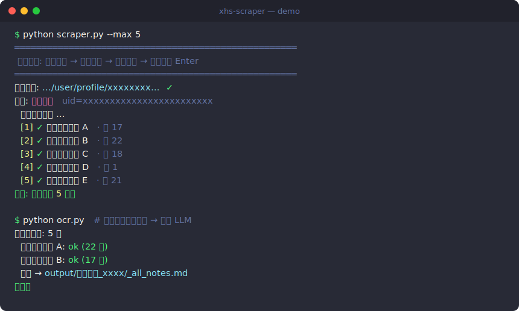

# xhs-scraper

[](https://www.python.org/)
[](https://playwright.dev/python/)
[](LICENSE)

A **human-like, semi-automatic scraper** for [Xiaohongshu / RED (小红书)](https://www.xiaohongshu.com)
creator pages. It drives a real logged-in browser the way a person would —
clicking note covers, reading the in-page modal — to collect a creator's
**captions, full-resolution images, and videos**, then optionally **OCRs the
images** to extract the text printed inside them (so you can feed it to an LLM).

English | [简体中文](README_zh_cn.md)

<p align="center">
  
</p>

---

## Why this approach

Xiaohongshu has aggressive anti-scraping. Opening a note **directly by URL**
hits a "scan QR to view" wall, even when logged in, because the `xsec_token`
is bound to its origin context. The trick is to **behave like a human**:

- Use a **persistent, logged-in Chromium profile** (scan the QR once).
- **Click the note cover** on the creator's page so Xiaohongshu opens it as an
  in-page modal via its own router — no full navigation, no wall.
- Read the note data from the live `window.__INITIAL_STATE__` store.
- Download images through the **authenticated browser context with a `Referer`
  header** to bypass hot-link protection.
- Pace actions with randomized delays.

This is a *semi*-automatic tool: you log in and navigate to the target creator;
the script takes over from there.

## Features

- 🔓 **Login once** — persistent session, no repeated QR scans.
- 🧑‍💻 **Human-like** — clicks covers, opens modals, randomized pacing.
- 🖼️ **Full-resolution** images (+ videos) and the note caption.
- 👥 **Generic** — works for *any* creator; output is organized per creator.
- ⏯️ **Resumable** — re-running skips already-downloaded notes.
- 🔤 **OCR pipeline** — extract text from image-based notes, offline & free
  ([RapidOCR](https://github.com/RapidAI/RapidOCR), Chinese + English).

## Requirements

- Python 3.10+
- A desktop environment that can show a browser window (Windows/macOS/Linux
  with a display; **WSL2 works via WSLg**).
- A Xiaohongshu account (to scan the login QR once).

## Installation

```bash
git clone <your-fork-url> xhs-scraper
cd xhs-scraper

python3 -m venv .venv
source .venv/bin/activate          # Windows: .venv\Scripts\activate

pip install -r requirements.txt
playwright install chromium
```

On Linux / WSL you also need the browser's system libraries:

```bash
sudo playwright install-deps chromium
```

## Usage

### 1. Scrape a creator

```bash
python scraper.py                  # scrape all notes on the current page
python scraper.py --max 5          # only the first 5 (good for a test run)
python scraper.py --inspect        # diagnostic: open first note & dump data
```

A browser window opens. Then:

1. **Log in** (scan the QR — only the first time).
2. **Search** for the target creator and open **their profile page**.
3. Return to the terminal and press **Enter**.

The script detects the creator, then iterates: open cover → extract → download
→ close → next. To scrape another creator, just navigate to their profile and
run again.

### 2. Extract text from images (OCR)

No browser needed — runs fully offline on the already-downloaded data:

```bash
python ocr.py                      # OCR everything under output/
python ocr.py output/<creator_dir> # only one creator
python ocr.py output/<creator_dir>/<note_dir>  # only one note
```

## Output layout

```
output/
└── <nickname>_<userId>/
    ├── _all_notes.md                 # all OCR text for this creator (LLM-ready)
    └── <noteId>_<title>/
        ├── text.md                   # caption (title + description)
        ├── note.json                 # raw extracted note data
        ├── text_ocr.md               # caption + per-image OCR text
        ├── img_01.webp ...           # full-resolution images
        └── video_01.mp4              # video, if the note is a video
```

## Command-line options

### `scraper.py`
| Flag | Description |
| --- | --- |
| `--max N` | Scrape at most N notes (counting existing ones). `0` = all (default). |
| `--inspect` | Diagnostic mode: open the first note and dump `_debug_*` artifacts. |
| `--url URL` | Open a profile URL directly instead of navigating manually (optional). |

### `ocr.py`
Pass one or more paths (a note dir, a creator dir, or `output/`). With no
argument it processes everything under `output/`. Existing `text_ocr.md` files
are skipped.

## How it works

1. `launch_persistent_context` keeps cookies in `browser-data/`, so login
   survives between runs.
2. After you press Enter, the script picks the tab whose URL contains
   `user/profile` (Xiaohongshu often opens profiles in a new tab).
3. It scrolls the feed, finds each visible `a.cover`, and clicks it. The note
   opens as a modal (`/explore/<id>?...&xsec_source=pc_user`).
4. It reads `window.__INITIAL_STATE__.note.noteDetailMap[id]` and extracts the
   title, description, high-resolution image URLs, and video streams — picking
   only scalar/array fields to avoid the store's circular references.
5. Images/videos are fetched via the authenticated `context.request` with a
   `Referer` header, then written to disk.
6. `ocr.py` runs RapidOCR on each image, orders the detected lines top-to-bottom,
   and writes per-note and per-creator Markdown.

## Troubleshooting

- **"scan QR to view note"** — make sure you logged in *in the script's browser
  window* (not your normal browser). The persistent profile is `browser-data/`.
- **Browser fails to launch on Linux/WSL** (`libasound.so.2` etc.) — run
  `sudo playwright install-deps chromium`.
- **No browser window on WSL** — you need WSLg (Windows 11 / recent Windows 10).
  Check `echo $DISPLAY` is set.
- **0 notes collected** — confirm the selected page is the creator's profile
  (URL contains `user/profile`). Use `--inspect` to dump diagnostics.
- **Selectors stopped working** — Xiaohongshu changes its frontend often. Run
  `--inspect` to capture the current DOM/state and adjust the selectors.

## Legal & disclaimer

This project is for **personal study and backup of content you are entitled to
access**. Scraping may violate Xiaohongshu's Terms of Service, and the content
you collect is likely copyrighted by its creators.

- Use it only on content you have a right to access.
- Keep request rates low and respectful.
- Do **not** redistribute or use scraped content commercially.
- You are solely responsible for how you use this tool.

The authors provide this software "as is", without warranty, and accept no
liability for misuse.

## License

[MIT](LICENSE) © 2026 ther-nullptr
